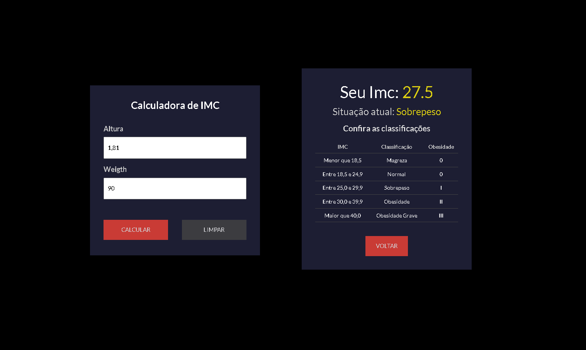

# 🏋️‍♂️ Calculadora de IMC

Projeto desenvolvido com Vite + React para cálculo de IMC (Índice de Massa Corporal).

---

## 💻 Sobre o projeto

Este projeto foi criado com o objetivo de praticar os conceitos do React e desenvolver uma calculadora de IMC funcional e simples.

### Conceitos aplicados:
- Componentização
- Props
- Hooks (useState)
- Manipulação e validação de inputs
- Organização de dados externos (`data.js`)
- Estilização com CSS puro

---

## 🚀 Tecnologias utilizadas

- [React](https://react.dev/)
- [Vite](https://vitejs.dev/)
- JavaScript
- CSS

---

📸 Demonstração
<p align="center">
  
</p>

## 📂 Estrutura dos dados

O projeto utiliza um arquivo `data.js` com os dados das classificações de IMC.

Exemplo da estrutura:

```javascript
export const data = [
  {
    min: 0,
    max: 18.4,
    classification: "Magreza",
    info: "Abaixo do peso",
    obesity: "0",
  },
  {
    min: 18.5,
    max: 24.9,
    classification: "Normal",
    info: "Peso ideal",
    obesity: "0",
  },
  ...
];

🧮 Lógica principal
O usuário informa altura e peso.

O sistema realiza o cálculo: IMC = peso / (altura * altura)

🎨 Estilização
Toda a parte visual foi desenvolvida com CSS puro, separado por arquivos individuais para cada componente.

Exemplo de componente Button:

import "./Button.css";

const Button = ({ id, text, action }) => {
  const handleAction = (e) => {
    action(e);
  };

  return <button id={id} onClick={handleAction}>{text}</button>;
};

export default Button;

▶️ Como executar o projeto
Pré-requisitos:
Node.js instalado

npm ou yarn instalado

Instalação:
Clone o repositório:

- git clone https://github.com/seu-usuario/seu-repositorio.git
- cd nome-do-projeto
- npm install
- npm run dev

🤝 Contato

Linkedin: https://www.linkedin.com/in/jefferson-rizzetto/
GitHub: https://github.com/JRizzetto