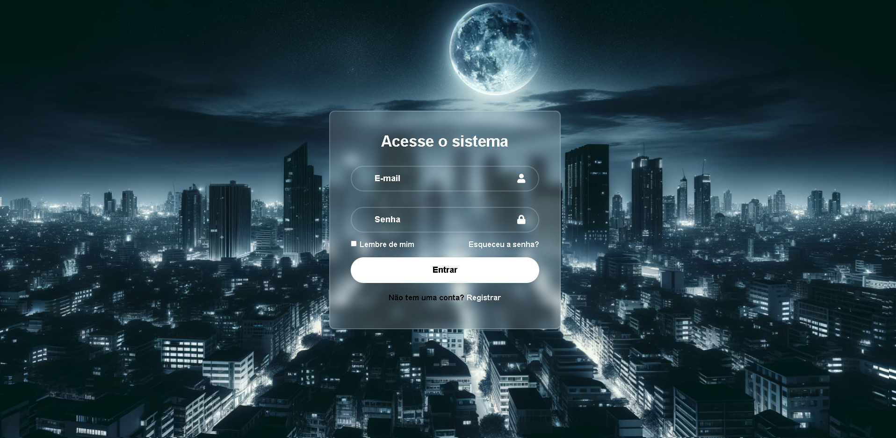

# 🛠️ Tela de Login com React + Backend Simulado

Este é um projeto de tela de login simples e responsiva, desenvolvido com React, Vite e React Icons. Agora também simula o envio de dados de login para um backend usando o [JSON Server](https://github.com/typicode/json-server), permitindo testar a autenticação com dados armazenados em um arquivo local (`db.json`).

---

## 🚀 Tecnologias Utilizadas

- [React](https://reactjs.org/)
- [Vite](https://vitejs.dev/)
- [React Icons](https://react-icons.github.io/react-icons/)
- [JSON Server](https://github.com/typicode/json-server)
- CSS3

---

## 📸 Prévia



---

## ⚙️ Funcionalidades

- Interface de login com campos de e-mail e senha
- Ícones personalizados nos inputs
- Simulação de autenticação com backend local
- Validação simples com mensagens de sucesso ou erro
- Feedback visual para o usuário durante o envio dos dados

---

## 🧪 Como testar localmente

### 1. Clone o repositório

```bash
git clone https://github.com/seu-usuario/seu-repositorio.git
cd seu-repositorio

2. Instale as dependências
npm install

3. Inicie o JSON Server (em outro terminal)
json-server --watch db.json --port 3001

4. Inicie a aplicação React
npm run dev

Acesse no navegador: http://localhost:5173

🧩 Dados de Teste
Para testar o login com sucesso, utilize o seguinte usuário (já incluso no db.json):

Email: usuario@teste.com

Senha: 123456

✨ Melhorias futuras
Validação de formulário com bibliotecas (ex: React Hook Form)

Integração com autenticação real (Node.js + JWT)

Tela de cadastro de novos usuários

Proteção de rotas após login

Feito com <3 por Jefferson Rizzetto